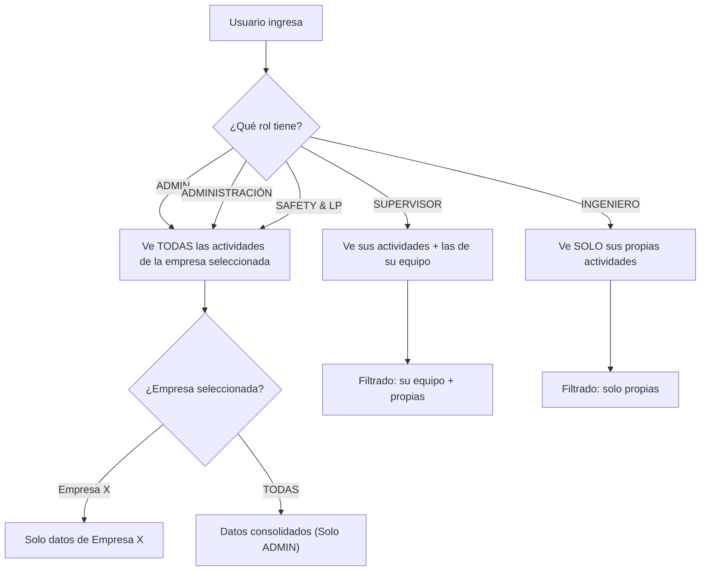

# 🦆 Perry App — Guía de Perfiles, Permisos y Recursos

> **Versión:** Mayo 2026  
> **Propósito:** Documento de referencia para que cualquier usuario entienda sus alcances, permisos y accesos dentro de Perry App.

---

## 📋 Tabla de Contenido

1. [Perfiles de Usuario](#-perfiles-de-usuario)
2. [Acceso a Páginas por Perfil](#-acceso-a-páginas-por-perfil)
3. [Permisos de Acción por Perfil](#-permisos-de-acción-por-perfil)
4. [ATC Finde — Permisos Especiales](#-atc-finde--permisos-especiales)
5. [Recursos y Compartición](#-recursos-y-compartición-entre-empresas)
6. [Visibilidad de Datos](#-visibilidad-de-datos)
7. [Guía Rápida por Rol](#-guía-rápida-por-rol)

---

## 👥 Perfiles de Usuario

Perry App tiene **5 perfiles** con niveles de acceso progresivos:

| # | Perfil | Código Interno | Descripción |
|---|--------|----------------|-------------|
| 🟣 | **Admin Maestro** | `ADMIN` | Control total. Configura empresas, usuarios, recursos y ve toda la información consolidada. |
| 🔴 | **Administración** | `ADMINISTRACION` | Acceso administrativo. Gestiona recursos y usuarios. Similar al Admin pero sin acceso a Consorcio. |
| 🟡 | **Supervisor** | `SUPERVISOR` | Lidera equipos de ingenieros. Ve las actividades de su equipo, puede asignar recursos y editar notas. |
| 🟢 | **Safety & L.P.** | `SUPERVISOR_SAFETY_LP` | Supervisa seguridad. Gestiona Safety Dedicados, choferes, auditorías y notas de seguridad. |
| 🔵 | **Ingeniero** | `INGENIERO` | Operativo. Registra sus propias actividades, consulta planes y exporta información. |

---

## 🗺️ Acceso a Páginas por Perfil

| Página | 🟣 Admin | 🔴 Admón | 🟡 Supervisor | 🟢 Safety&LP | 🔵 Ingeniero |
|--------|:--------:|:--------:|:-------------:|:------------:|:-------------:|
| **Dashboard** | ✅ | ✅ | ✅ | ✅ | ✅ |
| **Actividades** | ✅ | ✅ | ✅ | ✅ | ✅ |
| **Nueva Actividad** | ✅ | ✅ | ✅ | ✅ | ✅ |
| **ATC Finde** | ✅ | ✅ | ✅ | ✅ | ✅ |
| **Planes Pasados** | ✅ | ✅ | ✅ | ✅ | ✅ |
| **Recibos** | ✅ | ✅ | ✅ | ✅ | ✅ |
| **Importar Reporte** | ✅ | ✅ | ✅ | ✅ | ✅ |
| **Oportunidades** | ✅ | ✅ | ✅ | ✅ | ✅ |
| **Analítica** | ✅ | ✅ | ✅ | ✅ | ✅ |
| **Guía Perry** | ✅ | ✅ | ✅ | ✅ | ✅ |
| **Gestión de Clientes** | ✅ | ✅ | ✅ | ✅ | ❌ |
| **Gestión de Recursos** | ✅ | ✅ | ❌ | ❌ | ❌ |
| **Consorcio** | ✅ | ❌ | ❌ | ❌ | ❌ |

---

## ⚡ Permisos de Acción por Perfil

### Actividades

| Acción | 🟣 Admin | 🔴 Admón | 🟡 Supervisor | 🟢 Safety&LP | 🔵 Ingeniero |
|--------|:--------:|:--------:|:-------------:|:------------:|:-------------:|
| Ver todas las actividades | ✅ Todas | ✅ Todas | 👥 Su equipo | ✅ Todas | 👤 Solo propias |
| Crear actividades | ✅ | ✅ | ✅ | ✅ | ✅ |
| Editar actividades | ✅ Todas | ✅ Todas | 👥 Su equipo | ✅ Todas | 👤 Solo propias |
| Exportar CSV | ✅ | ✅ | ✅ | ✅ | ✅ |

> [!NOTE]
> **👥 "Su equipo"** = El supervisor ve sus propias actividades + las de los ingenieros que tiene asignados.

### Gestión de Recursos (página Usuarios)

| Recurso | 🟣 Admin | 🔴 Admón | 🟡 Supervisor | 🟢 Safety&LP | 🔵 Ingeniero |
|---------|:--------:|:--------:|:-------------:|:------------:|:-------------:|
| **Usuarios** — crear, editar, asignar empresas | ✅ | ✅ | ❌ | ❌ | ❌ |
| **Técnicos** — crear, editar, asignar empresa base | ✅ | ✅ | 👁️ Solo ver | 👁️ Solo ver | ❌ |
| **Safety Dedicado** — crear, editar | ✅ | ✅ | 👁️ Solo ver | ✅ | 👁️ Solo ver |
| **Vehículos** — crear, editar | ✅ | ✅ | 👁️ Solo ver | 👁️ Solo ver | ❌ |
| **Choferes** — crear, editar | ✅ | ✅ | ❌ | ✅ | ❌ |
| **Eq. de Elevación** — crear, editar | ✅ | ✅ | 👁️ Solo ver | 👁️ Solo ver | ❌ |
| **Contratistas** — crear, editar | ✅ | ✅ | ❌ | ❌ | ❌ |

---

## 🏗️ ATC Finde — Permisos Especiales

El Plan ATC Finde tiene permisos granulares por ser el módulo operativo más sensible:

| Acción | 🟣 Admin | 🟡 Supervisor | 🟢 Safety&LP | 🔵 Ingeniero |
|--------|:--------:|:-------------:|:------------:|:-------------:|
| **Asignar técnicos** a actividades | ✅ | ✅ | ✅ | ❌ |
| **Asignar Safety Dedicado** | ✅ | ❌ | ✅ | ❌ |
| **Asignar vehículos / choferes / equipos** | ✅ | ✅ | ✅ | ❌ |
| **Editar notas de fin de semana** | ✅ | ✅ | ✅ | ❌ |
| **Editar notas propias** en su actividad | — | — | — | ✅ |
| **Editar auditoría Safety** (notas + imagen) | ✅ | ❌ | ✅ | ❌ |
| **Ver auditoría Safety** | ✅ | ❌ | ✅ | ❌ |
| **Crear Día Extra** | ✅ | ✅ | ✅ | ❌ |
| **Editar horarios de actividad** | ✅ | ✅ | ✅ | 👤 Solo propias |
| **Editar LOTO / TERA** | ✅ | ✅ | ✅ | 👤 Solo propias |
| **Exportar PDF** | ✅ | ✅ | ✅ | ✅ |

---

## 🔗 Recursos y Compartición entre Empresas

Perry App opera con un sistema multiempresa. Aquí se detalla cómo se comparten (o aíslan) los recursos:

### Recursos con Empresa Base (aislados)

Estos recursos **pertenecen a una empresa específica** y permiten trazar préstamos inter-empresa:

| Recurso | ¿Tiene Empresa Base? | Comportamiento |
|---------|:--------------------:|----------------|
| **Usuarios** | ✅ `Empresa Base` + accesos | Cada usuario tiene una empresa base y puede tener acceso a múltiples empresas |
| **Técnicos** | ✅ `Empresa Base` | Asignados a su empresa. Cuando trabajan para otra, se registra en **Consorcio** |
| **Safety Dedicado** | ✅ `Empresa Base` | Asignados a su empresa base. Pueden asignarse como Dedicado o Designado |
| **Vehículos** | ✅ `Empresa Base` | Flotilla por empresa |
| **Choferes** | ✅ `Empresa Base` | Asignados a su empresa |

### Recursos Compartidos (globales)

Estos recursos son **visibles para todas las empresas** del grupo:

| Recurso | ¿Tiene Empresa? | Razón |
|---------|:---------------:|-------|
| **Clientes** | ❌ Compartido | Un cliente puede ser atendido por cualquier empresa del grupo |
| **Contactos** | ❌ Compartido | Los contactos de clientes son compartidos para facilitar la colaboración |
| **Eq. de Elevación** | ❌ Compartido | Los equipos se comparten entre empresas según disponibilidad |

### Actividades (aisladas por empresa)

| Dato | Aislamiento | Detalle |
|------|:-----------:|---------|
| **Actividades** | ✅ Por empresa | Cada actividad se registra bajo la empresa activa del usuario |
| **Dashboard KPIs** | ✅ Por empresa | Los indicadores reflejan solo la empresa seleccionada |
| **Oportunidades** | ✅ Por empresa | Derivadas de actividades, heredan el aislamiento |
| **ATC Finde / Planes** | ✅ Por empresa | Planes de fin de semana por empresa |

> [!IMPORTANT]
> **Selector de Empresa:** Los usuarios ADMIN pueden cambiar entre empresas usando el selector en la barra superior. Al seleccionar "TODAS", ven la información consolidada de todas las empresas a las que tienen acceso.

---

## 👁️ Visibilidad de Datos



---

## 🚀 Guía Rápida por Rol

### 🔵 Si eres INGENIERO

> Tu pantalla principal es **Actividades**. Aquí verás todas las actividades que te han asignado.

**Lo que puedes hacer:**
- ✅ Registrar nuevas actividades con el botón `+ Nueva`
- ✅ Importar reportes diarios
- ✅ Editar tus propias actividades (horarios, notas, LOTO, TERA)
- ✅ Ver el Plan ATC Finde y tus asignaciones de fin de semana
- ✅ Consultar Planes Pasados
- ✅ Exportar tus actividades a CSV
- ✅ Consultar la Guía Perry

**Lo que NO puedes hacer:**
- ❌ Ver actividades de otros ingenieros
- ❌ Asignar técnicos o recursos
- ❌ Gestionar usuarios o recursos
- ❌ Acceder al Directorio de Clientes

---

### 🟡 Si eres SUPERVISOR

> Tu enfoque es tu **equipo**. Ves todo lo que hacen tus ingenieros asignados.

**Lo que puedes hacer:**
- ✅ Todo lo que un Ingeniero, **más:**
- ✅ Ver actividades de tu equipo completo
- ✅ Asignar técnicos, vehículos y equipos en ATC Finde
- ✅ Editar notas de fin de semana
- ✅ Crear Días Extra en el plan
- ✅ Acceder al Directorio de Clientes

**Lo que NO puedes hacer:**
- ❌ Gestionar usuarios o crear nuevos perfiles
- ❌ Asignar Safety Dedicado
- ❌ Ver/editar auditorías de Safety
- ❌ Acceder a Consorcio

---

### 🟢 Si eres SAFETY & L.P.

> Tu dominio es la **seguridad**. Controlas Safety Dedicados, auditorías y choferes.

**Lo que puedes hacer:**
- ✅ Ver todas las actividades (todas las empresas asignadas)
- ✅ Gestionar Safety Dedicados (crear, editar)
- ✅ Gestionar Choferes
- ✅ Asignar Safety Dedicados en ATC Finde
- ✅ Editar auditorías Safety (notas + imagen)
- ✅ Crear Días Extra en el plan
- ✅ Acceder al Directorio de Clientes

**Lo que NO puedes hacer:**
- ❌ Gestionar usuarios o técnicos
- ❌ Acceder a Consorcio

---

### 🟣 Si eres ADMIN MAESTRO

> **Acceso total.** Eres el superusuario del sistema.

**Tienes acceso a:**
- ✅ **Todas** las páginas, **todos** los datos
- ✅ Gestión completa de usuarios, técnicos, recursos
- ✅ Selector de empresa (incluido "TODAS")
- ✅ Consorcio (registro de préstamos inter-empresa)
- ✅ Crear, editar, eliminar cualquier recurso
- ✅ Auditoría Safety completa

---

## 📊 Resumen Visual de Accesos

```
┌──────────────────────────────────────────────────────────┐
│                    🟣 ADMIN MAESTRO                       │
│  ┌────────────────────────────────────────────────────┐  │
│  │              🔴 ADMINISTRACIÓN                      │  │
│  │  ┌──────────────────────────────────────────────┐  │  │
│  │  │     🟡 SUPERVISOR    🟢 SAFETY & L.P.        │  │  │
│  │  │  ┌────────────────────────────────────────┐  │  │  │
│  │  │  │           🔵 INGENIERO                  │  │  │  │
│  │  │  │                                        │  │  │  │
│  │  │  │  • Mis actividades                     │  │  │  │
│  │  │  │  • Registrar / Editar propias          │  │  │  │
│  │  │  │  • ATC Finde (ver + editar mías)       │  │  │  │
│  │  │  │  • Exportar CSV                        │  │  │  │
│  │  │  └────────────────────────────────────────┘  │  │  │
│  │  │  + Actividades del equipo                    │  │  │
│  │  │  + Asignar recursos en ATC Finde             │  │  │
│  │  │  + Directorio de Clientes                    │  │  │
│  │  │  + Crear Días Extra                          │  │  │
│  │  └──────────────────────────────────────────────┘  │  │
│  │  + Gestión de Recursos (usuarios, técnicos...)     │  │
│  └────────────────────────────────────────────────────┘  │
│  + Consorcio (préstamos inter-empresa)                   │
│  + Selector "TODAS" las empresas                         │
└──────────────────────────────────────────────────────────┘
```

---

> [!TIP]
> **¿Necesitas un acceso diferente?** Contacta a un Admin Maestro para ajustar tu perfil o asignarte empresas adicionales.

---

*Documento generado desde el código fuente de Perry App — Mayo 2026*
